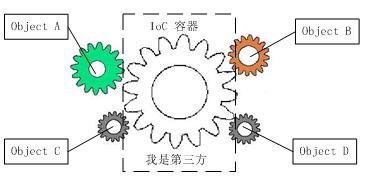
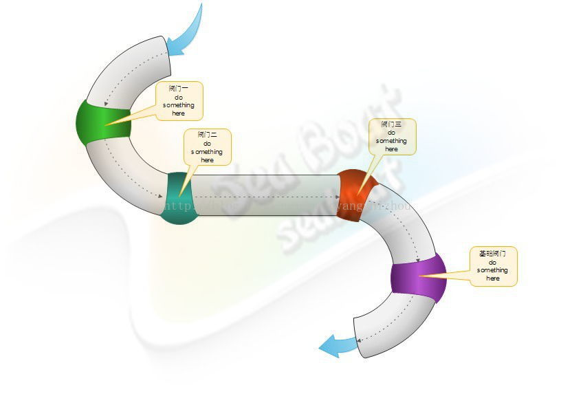
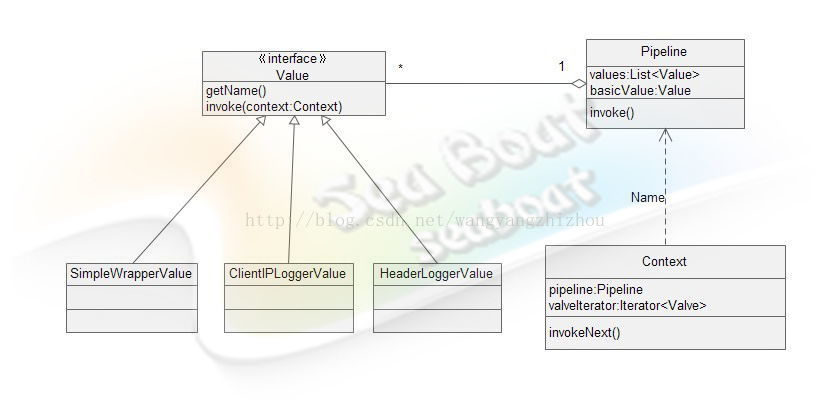

## 安装
```
// 非vue脚手架项目
npm install better-vue vue
// vue脚手架创建项目
npm  install better-vue
```

## 使用说明
- ####概念
    * IoC 容器
    
        ######IOC是Inversion of Control的缩写，多数书籍翻译成“控制反转”。
        ######1996年，Michael Mattson在一篇有关探讨面向对象框架的文章中，首先提出了IOC 这个概念。对于面向对象设计及编程的基本思想，前面我们已经讲了很多了，不再赘述，简单来说就是把复杂系统分解成相互合作的对象，这些对象类通过封装以后，内部实现对外部是透明的，从而降低了解决问题的复杂度，而且可以灵活地被重用和扩展。
        ######IOC理论提出的观点大体是这样的：借助于“第三方”实现具有依赖关系的对象之间的解耦。如下图：
         
        ######　大家看到了吧，由于引进了中间位置的“第三方”，也就是IOC容器，使得A、B、C、D这4个对象没有了耦合关系，齿轮之间的传动全部依靠“第三方”了，全部对象的控制权全部上缴给“第三方”IOC容器，所以，IOC容器成了整个系统的关键核心，它起到了一种类似“粘合剂”的作用，把系统中的所有对象粘合在一起发挥作用，如果没有这个“粘合剂”，对象与对象之间会彼此失去联系，这就是有人把IOC容器比喻成“粘合剂”的由来。
    * 服务
 
        ######为完成以一定任务提供接口方法的类
    * 服务提供者
    
        ######将服务注册到IOC容器內提供给程序开发者使用的类
    * 管道 
    
        ######管道模式用于将复杂的进程分解成多个独立的子任务。每个独立的任务都是可复用的，因此这些任务可以被组合成复杂的进程。 这种模式允许你讲庞大的进程分解成更小的子任务，这些子任务将数据进行处理并将处理后的结果传递给下一个子任务。就像流水线一样，有条不紊，从原料加工到成品，实现一道完整的工序。 管道中的每一个任务都会接受并返回同一类型的数据，这样子任务可以在管道中被添加、移除或者替换，而不影响其它子任务。
        ### Pipeline 的特点
          
             * 管道就像一个流水线，把复杂的问题的解决方案分解成一个个处理单元，然后依次处理，前一个处理单元的结果也是第二个模块的输出。
             * 这些处理步骤通常会放在一个数组里，方便迭代这个数组时顺序执行
             
             
         
        ####管道模式的优点
            * 管道模式有很多优点： 首先，将复杂的处理流程分解成独立的子任务，从而方便测试每个子任务； 其次，被分解的子任务可以被不同的处理进程复用，避免代码冗余。 最后，在复杂进程中添加、移除和替换子任务非常轻松，对已存在的进程没有任何影响。
        ####管道模式的缺点
            * 当然，管道模式也有缺点： 虽然每个子任务变得简单了，但是当你再度尝试将这些子任务组合成完整进程时有一定复杂性； 此外你还需要保证独立子任务测试通过后整体的流程能正常工作，这有一定的不确定性。 最后，当你看到的都是一个个子任务时，对理解整体流程带来困难（盲人摸象的故事想必大家很熟悉，正是此理）。
        
   * 中间件
        ######中间件为过滤进入应用程序的 HTTP 请求提供了一种方便的机制。例如，Laravel 内置了一个中间件来验证用户的身份认证。如果用户没有通过身份认证，中间件会将用户重定向到登录界面。但是，如果用户被认证，中间件将允许该请求进一步进入该应用。
    
- ####框架原理

    * 架构结构设计图
    * 原理说明
    
- ####测试用例
